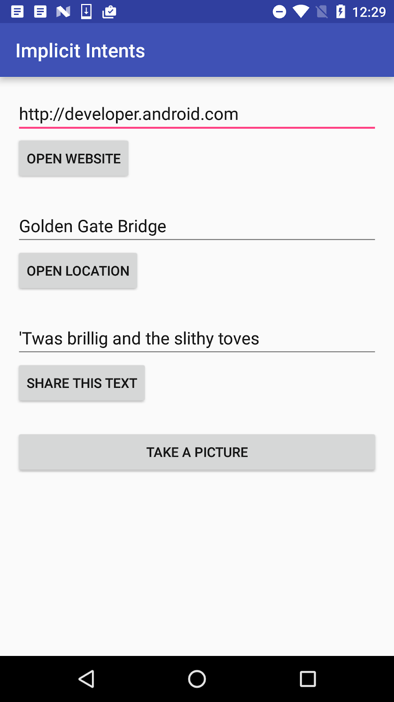

# Travail à faire

## Créer et exécuter une application

Ouvrez l'application [ImplicitIntents](https://github.com/khammami/android-fundamentals-apps-v2/tree/master/ImplicitIntents) que vous avez créée.

1. Ajoutez un autre bouton au bas de l'écran.
2. Lorsque le bouton est cliqué, lancez une application appareil photo pour prendre une photo. (Vous n'avez pas besoin de retourner la photo à l'application d'origine.)

> Note:
>
> Si vous utilisez l'émulateur Android pour tester la caméra, ouvrez la configuration de l'émulateur dans le gestionnaire AVD Android, choisissez **Advanced Settings**, puis choisissez **Emulated** pour les caméras avant et arrière. Redémarrez votre émulateur si nécessaire.

## Répondre à ces questions

### **Question 1**

Quelle méthode de constructeur utilisez-vous pour créer une intention implicite de lancer une application de caméra?

- [ ] `new Intent()`
- [ ] `new Intent(Context context, Class<?> class)`
- [ ] `new Intent(String action, Uri uri)`
- [ ] `new Intent(String action)`

### **Question 2**

Lorsque vous créez un objet Intention implicite, lequel des énoncés suivants est vrai?

- [ ] Ne spécifiez pas l'activité ou autre composant spécifique à lancer.
- [ ] Ajoutez une action d'intention ou une catégorie d'intention (ou les deux).
- [ ] Résolvez l'intention avec le système avant d'appeler `startActivity()` ou `startActivityforResult()`.

### **Question 3**

Quelle action Intention utilisez-vous pour prendre une photo avec une application appareil photo?

- [ ] `Intent takePicture = new Intent(Intent.ACTION_VIEW);`
- [ ] `Intent takePicture = new Intent(Intent.ACTION_MAIN);`
- [ ] `Intent takePicture = new Intent(MediaStore.ACTION_IMAGE_CAPTURE);`
- [ ] `Intent takePicture = new Intent(Intent.ACTION_GET_CONTENT);`

## Soumettez votre application pour la notation

Vérifiez que l'application dispose des éléments suivants:

* Il affiche un bouton **Take a Picture** en bas de l'application.
* Lorsque vous cliquez dessus, le bouton lance une application de caméra sur le périphérique.
* Avant d'envoyer l'intention, la méthode `onClick()` du bouton **Take a Picture** garantit qu'une application est disponible sur le périphérique, à l'aide des méthodes `resolActivity()` et `getPackageManager()`.
